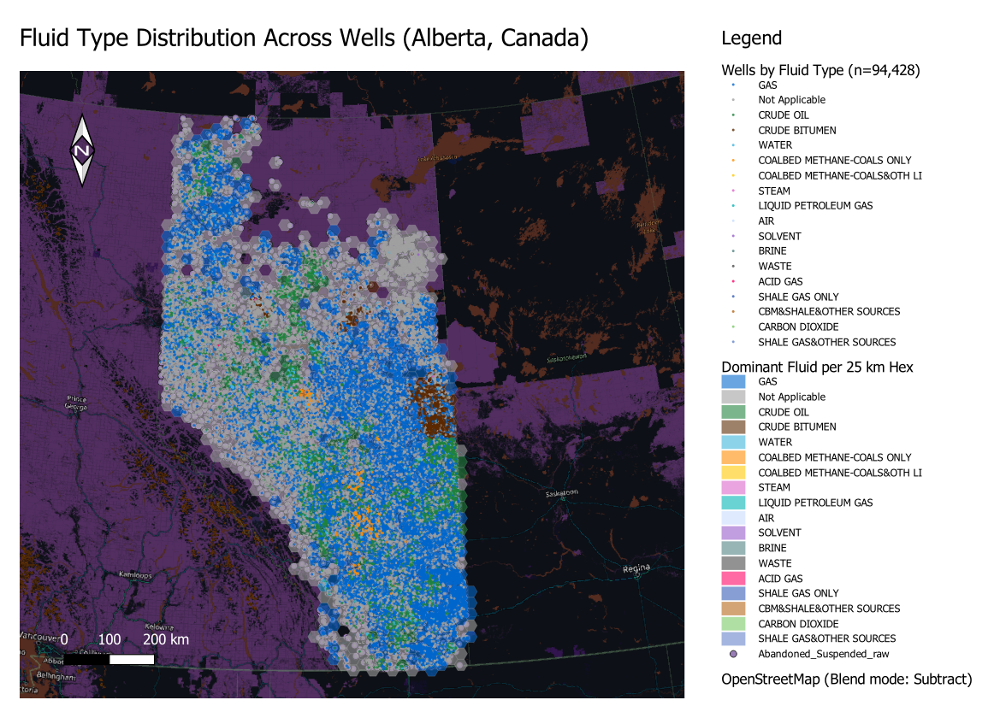

# Analysis 04 — Fluid-Type Distribution: Tracing Alberta's Petroleum Geography

*Generated: 2026-04-30*

## 1. Objective

Map every well in the dataset by the **fluid** it produced (or, for utility
wells, the fluid it handled) to expose Alberta's geological footprint:

- Where do **gas** wells dominate? (Deep Basin, shallow gas plays)
- Where do **crude oil** wells cluster? (Conventional oil plays)
- Where do **crude bitumen** wells concentrate? (Oil-sands belt)
- Are there sub-plays for **coalbed methane**, **steam** (SAGD), or
  **acid gas**?

This is the most visually-driven of the five analyses — the map *is* the
geology.

## 2. Input Data
| Item | Value |
|------|-------|
| Source | `Abandoned_Suspended_raw.shp` |
| Working CRS | EPSG:3400 (NAD83 / Alberta 10-TM Forest, metres) |
| Total wells | 94,428 |
| Distinct fluid values | 18 |
| Persisted as | `Input/all_wells.gpkg` |

## 3. Methodology

### 3.1 Per-fluid attribute aggregation
For each value of `Fluid`, computed:
- Total well count and share of dataset.
- Mean centroid (re-projected to lat/lon for readability).
- Bounding-box diagonal length in km — a proxy for *geographic concentration*.
  A small diagonal indicates a tight, single-region play; a large diagonal
  indicates a province-wide footprint.

### 3.2 Dominant-fluid hex grid
A 25 km hexagonal grid was generated over the wells extent
(`native:creategrid`, type=hexagon). Each well was joined to its hex via a
*within* spatial join (`native:joinattributesbylocation`). For every
non-empty hex, the script computed:
- `total` — total wells in the hex.
- `dom_fluid` — modal fluid value.
- `dom_count`, `dom_share` — counts and percentage for that dominant fluid.
- `n_fluids` — number of distinct fluids present.
- `shannon` — Shannon entropy *H = − Σ pᵢ ln(pᵢ)* across the fluid mix
  inside the hex; higher = more diverse, lower = single-fluid dominance.

### 3.3 Visualization
Two layers are stacked in the QGZ:
1. The hex grid, coloured by `dom_fluid` (background canvas).
2. The full point dataset, also coloured by `Fluid` (foreground points,
   small markers).

The colour palette is geologically suggestive: gas = deep blue, oil = green,
bitumen = dark brown, water = cyan, coalbed methane = orange, steam (SAGD)
= pink, "Not Applicable" = neutral grey.

## 4. Outputs
| File | Type | Contents |
|------|------|----------|
| `Input/all_wells.gpkg` | Vector (Point) | All 94,428 wells, EPSG:3400 |
| `Output/hex_dominant_fluid.gpkg` | Vector (Polygon) | 984 hexes with dominant fluid, share, diversity (Shannon entropy) |
| `04_Fluid_Type_Distribution.qgz` | QGIS project | Pre-styled, ready to open |

## 5. Key Findings

### 5.1 Three fluids account for **87%** of all wells
| Rank | Fluid | Share |
|-----:|:------|------:|
| 1 | GAS | 34.1% |
| 2 | Not Applicable | 32.7% |
| 3 | CRUDE OIL | 20.5% |
| | *(combined)* | **87.3%** |

The very large *"Not Applicable"* tier is striking — roughly a third of
inactive wells in Alberta are not categorised as producing any specific
fluid. These are predominantly observation, evaluation, disposal, and
service wells. Effectively, one in three abandoned wells in Alberta was
not a producer.

### 5.2 Geographic footprint — concentration vs sprawl

| Fluid | Wells | Share | Centroid (Lat, Lon) | Bbox span | Likely region |
|:------|------:|------:|:--------------------|----------:|:--------------|
| GAS | 32,187 | 34.09% | 52.52 N, 112.63 W | 1,397 km | Mixed / multiple regions |
| Not Applicable | 30,872 | 32.69% | 54.65 N, 113.20 W | 1,397 km | Mixed / multiple regions |
| CRUDE OIL | 19,376 | 20.52% | 52.81 N, 112.64 W | 1,362 km | Mixed / multiple regions |
| CRUDE BITUMEN | 6,984 | 7.40% | 54.25 N, 110.88 W | 621 km | Cold Lake region |
| WATER | 3,542 | 3.75% | 53.00 N, 113.17 W | 1,353 km | Foothills / Cardium country |
| COALBED METHANE-COALS ONLY | 686 | 0.73% | 52.47 N, 113.30 W | 644 km | Foothills / Cardium country |
| COALBED METHANE-COALS&OTH LITH | 416 | 0.44% | 51.57 N, 112.97 W | 1,137 km | Mixed / multiple regions |
| STEAM | 228 | 0.24% | 55.39 N, 112.21 W | 709 km | Mixed / multiple regions |
| LIQUID PETROLEUM GAS | 24 | 0.03% | 52.11 N, 112.22 W | 475 km | Mixed / multiple regions |
| AIR | 24 | 0.03% | 54.56 N, 111.61 W | 1,103 km | Mixed / multiple regions |

The contrast in **bbox span** is the geological signal:
- **CRUDE BITUMEN — 621 km span**, centroid at 54.26°N, 110.88°W. This is
  the tightest large-fluid footprint, sitting squarely on the **Athabasca /
  Cold Lake oil-sands belt**. The hex map reveals 26 bitumen-dominant hexes,
  forming a contiguous NE Alberta cluster.
- **STEAM — 709 km span**, centroid 55.39°N. Steam-injection wells are
  almost exclusively associated with **SAGD oil-sands operations**, again
  in the NE.
- **COALBED METHANE-COALS ONLY — 644 km span**, centroid 52.47°N. This sits
  on the **Cardium / Foothills coal belt** of west-central Alberta.
- **GAS, CRUDE OIL, Not Applicable** — all span ~1,400 km, i.e. the entire
  province. These are not "plays"; they are pervasive across the Western
  Canadian Sedimentary Basin.

### 5.3 Dominant-fluid hex distribution
| Dominant fluid in hex | # of hexes | % of populated hexes |
|:----------------------|-----------:|---------------------:|
| Not Applicable | 469 | 47.7% |
| GAS | 365 | 37.1% |
| CRUDE OIL | 118 | 12.0% |
| CRUDE BITUMEN | 26 | 2.6% |
| COALBED METHANE-COALS ONLY | 3 | 0.3% |
| BRINE | 1 | 0.1% |
| WATER | 1 | 0.1% |
| COALBED METHANE-COALS&OTH LITH | 1 | 0.1% |

Of 984 populated hexes:
- ~48% are dominated by *Not Applicable* (utility/observation wells) — they
  are spread broadly across the province.
- ~37% are dominated by *Gas*.
- ~12% are dominated by *Crude Oil*.
- Just **2.6% of hexes (26 cells)** are dominated by *Crude Bitumen* — but
  those 26 hexes are spatially contiguous and visually unmistakable as the
  oil-sands belt.
- The handful of *Coalbed Methane*–dominant hexes trace the Cardium coal
  belt; *Brine* / *Water* dominate one or two hexes apiece, likely
  associated with disposal injection or salt-water-disposal wells.

### 5.4 Diversity (`shannon`) interpretation
Hexes with low `shannon` (close to 0) contain wells of essentially one
fluid type — pure plays. Hexes with high `shannon` (>1.4) are mixed-fluid
zones. Open the attribute table and sort `shannon` ascending: the lowest
values fall in the bitumen and coalbed-methane belts (single-purpose
plays). The highest values fall in zones where oil, gas, and utility wells
overlap — typically older, multi-target conventional regions of east-central
Alberta.

## 6. How to Reproduce
1. Open `04_Fluid_Type_Distribution.qgz` in QGIS 3.x.
2. Two layers should load:
   - **Dominant Fluid per 25 km Hex** (background, semi-transparent fills)
   - **Wells by Fluid Type** (foreground point dots)
3. Both share the same legend categories. Toggle the points off to view
   the hex play map alone, or toggle hexes off to view the raw point cloud.
4. Identify any hex to read its `dom_fluid`, `dom_share`, `n_fluids`, and
   `shannon` values.

## 7. Notes & Caveats
- A single fluid value per well is recorded; wells producing or handling
  multiple fluids over their lifecycle would only show the latest entry.
- The *Not Applicable* category aggregates several distinct purposes
  (observation, disposal, evaluation, water source/injection) which the raw
  shapefile does not break apart.
- 25 km hex resolution was chosen to match the smoothing scale of Analyses
  01 and 03. Smaller hexes (e.g., 10 km) better resolve sub-plays but
  produce more noise in low-density areas.
- The bbox-diagonal proxy for spread is sensitive to outliers — a single
  outlying well from a different region can inflate the diagonal. The
  centroid + dominant-hex map together give a more reliable picture.
- This analysis does not consider *production volume*, only *well count*.
  A few high-output bitumen wells can produce as much as thousands of
  shallow gas wells.

---

## Map Preview

